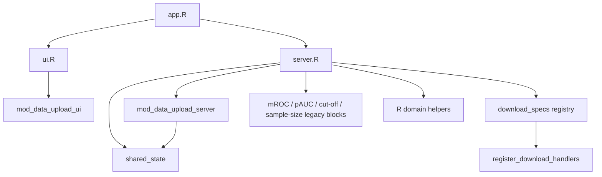

# easyROC Architecture Draft

Last updated: 2026-04-17
Status: draft
Owner: team
Related Sprint Issues: EASY-013, EASY-014, EASY-015, EASY-016, EASY-017, EASY-018

## 1) Scope

Bu belge Sprint 2 sonunda olusan mimari resmi ve hedeflenen moduler yapinin gecis planini tanimlar.

## 2) Current Architecture (Sprint 2 Snapshot)

## 3) Implemented Module Contracts

| Module/Unit | Responsibility | Input Contract | Output Contract |
|---|---|---|---|
| `app.R` | Ince giris noktasi | `ui.R`, `server.R` source sonucu | `shiny.appobj` |
| `mod_data_upload_ui` | Veri yukleme UI | Module `id` | Upload + status/event secim bilesenleri |
| `mod_data_upload_server` | Veri yukleme/validasyon + secim baglama | `id`, `shared_state` | `data`, `status_var`, `event_value` reaktifleri |
| `shared_state` | Moduller arasi ortak state kontrati | `createSharedState()` | `data`, `status_var`, `event_value`, `upload_error` |
| `mod_downloads` helpers | Download orkestrasyonu | `download spec` listesi | Tek noktadan `downloadHandler` kaydi |

## 4) Shared State Contract

`R/shared_state.R` alanlari:

- `data`: aktif veri seti (`reactiveVal`)
- `status_var`: secili status degiskeni (`reactiveVal`)
- `event_value`: secili case kategorisi (`reactiveVal`)
- `upload_error`: dosya yukleme hata mesaji (`reactiveVal`)

Gecerlilik:

- `validateSharedState()` ile alan varligi ve tipi (fonksiyon/reactiveVal arayuzu) dogrulanir.

## 5) Download Orchestration Contract

`R/mod_downloads.R` yardimcilari:

- `create_download_handler_spec(filename, content, content_type = NULL)`
- `register_download_handlers(output, specs)`

Yaklasim:

- Her indirme akisi `download_specs` listesine eklenir.
- Tum handlerlar `register_download_handlers` ile tek noktada kaydedilir.
- Bu model yeni indirme akisi eklerken daginik `output$download*` bloklarini azaltir.

## 6) Target Architecture (Sprint 3+)

Hedef katman:

- `app.R` (entrypoint)
- `R/mod_*` (feature modules)
- `R/services/*` (application orchestration)
- `R/domain/*` (istatistiksel cekirdek)
- `R/adapters/*` (dosya/paket adapterleri)

Hedef moduller:

- `mod_roc_analysis`
- `mod_partial_auc`
- `mod_cut_points`
- `mod_sample_size`
- `mod_downloads`
- `mod_docs_about`

## 7) Planned Migration Steps

1. `EASY-019`: Refactor smoke test kapsam notu + dogrulama
2. `EASY-020`: ROC analysis akisini `mod_roc_analysis`a tasima
3. `EASY-021`: pAUC akisini `mod_partial_auc`a tasima
4. `EASY-022`: cut-point akisini `mod_cut_points`a tasima
5. `EASY-023`: sample-size akisini `mod_sample_size`a tasima

## 8) Risks and Guardrails

- Davranis esdegerligi riski:
  - Her moduler tasimada mevcut referans ciktilar ve testler korunur.
- State daginikligi riski:
  - Yeni moduller `shared_state` kontrati disina cikmaz.
- Download daginikligi riski:
  - Yeni handlerlar sadece spec kaydi ile eklenir.

## 9) Out of Scope (This Draft)

- Cizim araci tabanli final mimari diyagram exportlari (png/svg)
- Faz-2 migration ayrintili adimlari bu dokumanin disinda detaylandirilir (`docs/migration-phase2.md`)
