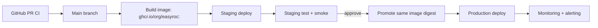

# easyROC Deployment Target Architecture

Last updated: 2026-04-17  
Status: accepted  
Owner: team  
Related Sprint Issue: EASY-039

## 1) Scope

Bu dokuman Sprint 6 kapsaminda deployment hedef mimarisini kesinlestirir.  
Amac, staging/prod stratejisini tek bir karar setinde sabitlemek ve EASY-040..044 adimlari icin net teknik zemin olusturmaktir.

## 2) Karar Ozeti

| Alan | Karar | Gerekce |
|---|---|---|
| Runtime modeli | Container-first (Docker) | Tekrarlanabilir build/deploy, cevreler arasi tutarlilik |
| Ortam stratejisi | Ayrik `staging` ve `production` | Guvenli dogrulama + kontrollu gecis |
| Release modeli | Immutable image + promote | Ayni artifact'in staging->prod gecisi, drift riskini azaltma |
| Rollback | Onceki image digest'e geri donus | Hizli ve dusuk riskli geri alim |
| Konfig yonetimi | Runtime env var + secret store | Kaynak koddan ayrik gizli bilgi yonetimi |
| Trafik girisi | Reverse proxy (TLS terminasyon) + Shiny app container | Operasyonel sadelik, standart HTTP/TLS katmani |

## 3) Hedef Topoloji

Topoloji notlari:

- Staging ve production ayri host/namespace uzerinde calisir.
- Uygulama state'i oturum bazli oldugu icin sunucu tarafi kalici DB zorunlu degildir.
- Kalici artifact ihtiyaci (log/export) olursa harici volume/object storage kullanilir.

## 4) Cevre Stratejisi (Staging/Production)

| Baslik | Staging | Production |
|---|---|---|
| Amac | Release adayi dogrulama | Canli trafik |
| Trafik | Sinirli (ic ekip / test) | Gercek kullanici |
| Veriler | Sentetik/anonymized | Kurumsal politikalara uygun canli veri |
| Release tetigi | Her uygun merge veya aday etiket | Manuel onayli promote |
| Basari kosulu | Smoke + kritik akislarda test gecisi | SLO ve hata oraninin korunmasi |

Zorunlu ilke:

- Prod'a giden image, staging'de dogrulanan digest ile birebir ayni olmalidir.

## 5) Release ve Rollback Modeli

Release:

1. CI test/lint yesil.
2. Image build edilir ve digest ile registry'ye yazilir.
3. Staging ortamina deploy edilir.
4. Staging smoke/regresyon dogrulanir.
5. Ayni digest production'a promote edilir (yeniden build yok).

Rollback:

1. Son stabil digest listeden secilir.
2. Deploy manifest/compose image referansi bir onceki digest'e alinir.
3. Hizmet yeniden baslatilir.
4. Health check ve kritik akis smoke testleri tekrar calistirilir.

## 6) Guvenlik ve Konfigurasyon Sinirlari

- Secret'lar repo icinde tutulmaz.
- Secret/env degerleri deploy asamasinda ortama enjekte edilir.
- TLS terminasyonu reverse proxy katmaninda zorunludur.
- Container non-root calisma hedefi EASY-040 kapsaminda uygulanir.
- Loglarda gizli bilgi ve kisisel veri maskelenir (EASY-042).

## 7) Operasyonel Baslangic Hedefleri

Bu hedefler Sprint 6 sonunda asgari cizgi olarak kabul edilir:

- P0 deployment hatasinda rollback suresi: <= 15 dk
- Staging'de release adayi dogrulama suresi: <= 30 dk
- Health-check tabanli acilis dogrulamasi: zorunlu (EASY-043)

## 8) Sonraki Issue'lara Baglanti

- EASY-040: Bu mimariye uygun container/runtime recetesi uygulanmistir.
- EASY-041: Secret/env yonetimi bu dokumandaki sinirlara gore standardize edilmistir.
- EASY-042: Loglama ve hata izleme katmani bu topolojiye eklenmistir.
- EASY-043: Readiness/health check kontratlari tanimlanmistir.
- EASY-044: Deployment ve runbook dokumanlari bu karar setine gore finalize edilmistir.
- EASY-045: Release checklist bu karar setiyle hizali sekilde finalize edilmistir.

EASY-040 implementation note (2026-04-17):

- Container/runtime recetesi `Dockerfile`, `docker-compose*.yml`, `.env.example`, `scripts/deploy_compose.sh` ve `docs/container-runtime-recipe.md` ile uygulanmistir.

EASY-041 implementation note (2026-04-17):

- Env + secret yonetimi `docs/env-secret-management.md`, `scripts/validate_env.sh` ve `*.env.*.example` dosyalari ile standardize edilmistir.

EASY-042 implementation note (2026-04-17):

- Structured logging ve hata izleme taban cizgisi `R/logging_utils.R`, `docs/observability.md` ve modullerdeki olay loglari ile devreye alinmistir.

EASY-043 implementation note (2026-04-17):

- Health-check/readiness kontrati `scripts/healthcheck.R`, compose `healthcheck` ayari ve `docs/healthchecks.md` ile devreye alinmistir.

EASY-044 implementation note (2026-04-17):

- Operasyonel deployment/runbook dokumanlari `docs/deployment.md` ve `docs/runbook.md` ile tamamlanmistir.

EASY-045 implementation note (2026-04-17):

- Release gate checklist'i `docs/release-checklist.md` ile finalize edilmistir.
